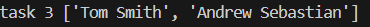
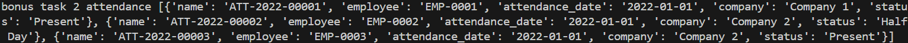
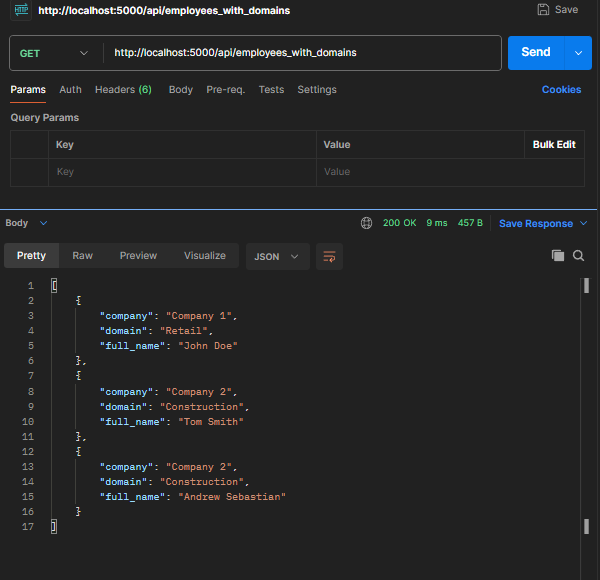
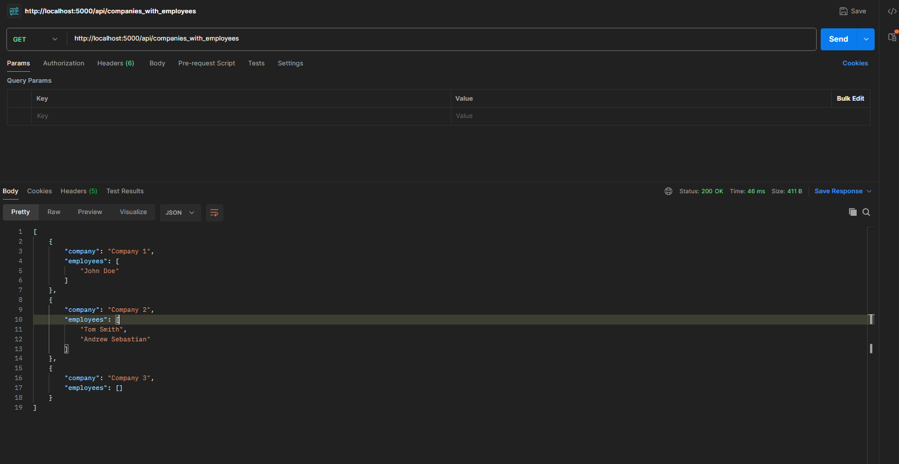
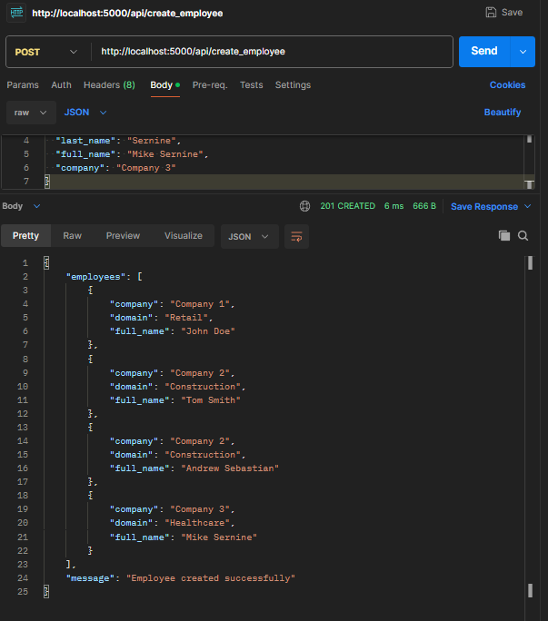
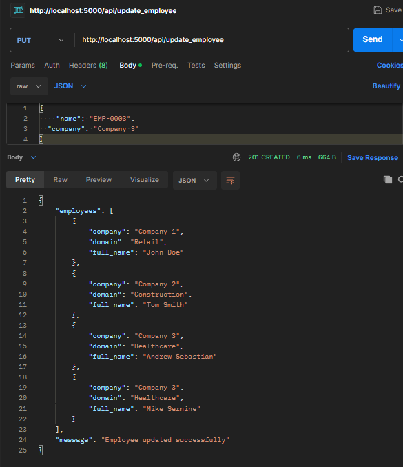
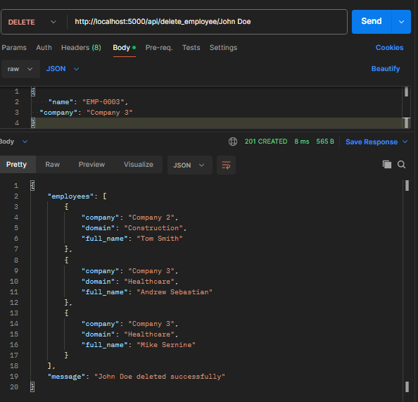

# Technical Test On Software Developer (Backend) team in Agile Technica. 

## Setup 
instal package
```bash
pip install Flask Flask-Caching
```


## Start Development Server On http://localhost:5000/
Start Dev

```bash
phyton main.py
```


- Task 1 complete 

- Task 2 complete 

- Task 3 complete 

- Task 4 complete 
- Task 5 complete 
- Task Bonus Complete
- Task Bonus 2 Complete


## ENDPOINT http://localhost:5000/api
- GET /employees_with_domains

- GET /companies_with_employees
 

<!-- (BONUS) CREATE API FOR EMPLOYEE CRUD IMPLEMENTATION -->
- POST /create_employee
request body:
``` json
{
  "name": "EMP-0004",
  "first_name": "Mike",
  "last_name": "Sernine",
  "full_name": "Mike Sernine",
  "company": "Company 3"
}
```



- PUT /update_employee
request body:
``` json
{
    "name": "EMP-0003",
  "company": "Company 3"
}
```



- DELETE /delete_employee/"EMP-0001"

